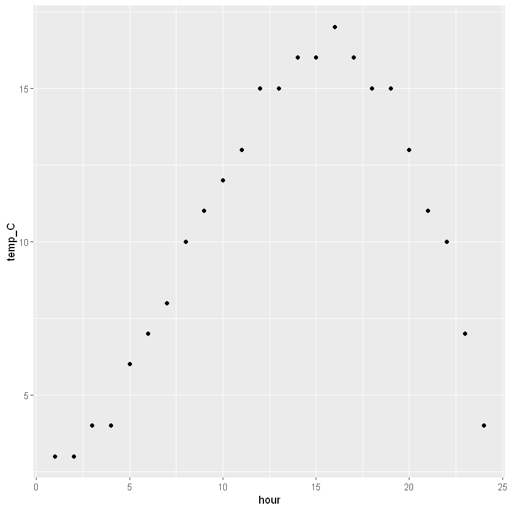

This interactive tutorial will get you started on your data-exploration road and make you familiar with some core
concepts of R and programming.

#### Table of Contents
1. [Data Types and Variables](#1-data-types-and-variables)
2. [Operators](#2-operators)
3. [Functions](#3-functions)
4. [Data Structures](#4-data-structures)
5. [Visualizing Data](#5-visualizing-data)
6. [Extra: Loops and Conditionals](#6-extra-loops-and-conditionals)

Notice that it is not at all expected that you learn all these things and they are burnt into your brain (!!!!!). 
It is more of a broad intrdocution to all the basics so you have hard of them, but programmers do look up stuff
all the time! So don't worry if it is a lot of input right now, just try to understand the concepts and you 
can always come back and find help in here, in the internet or from me directly.
  
Here are some useful ressources if you get stuck:

[Link: A general tutorial on several topics](https://www.tutorialkart.com/r-tutorial/)

[Link: A comprehensive list of built-in functions](https://www.javatpoint.com/r-built-in-functions)

and last but not least, if you need help with a specific function (we will talk about functions later), you can 
use the nice inbuilt method help(). For example you can run help(paste) and will directly see the documentation
for that function
```
help(paste)
``` 


### 1. Data Types and Variables
To work with data of course we somehow have to create or read data to work on.
In programming when we say that we "assign", it means that we define a variable name and
give it a certain value. In the following example you see four assignments of different values to
variable names:

```R
a = 5 # <-- the variable "a" has the value 5
b = 6.1 # the variable "b" has the value 6.1
name = "lucas" # the variable "name" has the value "lucas"
truth = TRUE # the variable truth has the value TRUE
```


Now lets take a look at these variables. You can show them below the cell by just writing their name:
```R
a
b
name
truth
```
Ouput:
```
5
6.1
'lucas'
TRUE
```

You can probably already see that the values of these variables are a bit different. We have numbers, 
numbers with decimals, some letters and the strange "TRUE"-value. We will not talk about data types 
in depth but knowing some basics is very helpful for your future tasks, so lets have a look at some of them. 
As a little exercise you can run the following code and take a look at the output in the console:

```R
typeof(a)
typeof(b)
typeof(name)
typeof(truth)
```
Ouput:
```R
'double'
'double'
'character'
'logical'
```

What you see are the different types that the values of the variables have. In R there are 6 types
of data but for us right now only 3 of them are of interest for us:

1. **double**: In simple terms, a double is a number that has decimals. But since double is also the
default type assigned to values that do not have decimals, we will ignore other numeric
types for now.

2. **character**: a character basically represents letters. If you have a series of characters together (like a
word) we call it a "string". So ’a’ is a character but "apple" is a string

3. **logical**: the logical type is the one of our three that is not intuitive from everyday life. It is a value
that can only have two states: TRUE or FALSE (often times also 1 or 0 which represents
the same). We will come back to that when we talk about operators in the next chapter.


### 2. Operators


Now that we have some variables it is time to do something with them. There are several
operations that you can do in R. The basic arithmetic operators ("mathematical" operators) are
+, -, *, / and **. They do pretty much exactly what you would expect: add, subtract, multiply,
divide and finally (maybe not so obvious) exponentiation. You can run the following in your editor
and see the output in the console below:
```R
a + b
b - a
a * b
b / a
a ** 2
```
Output:
```R
11.1
1.1
30.5
1.22
25
```
Notice that we did not store the results in a variable. If we want to have access to the results 
later in the script we need to assign the results to variables like this:
```R
c = a + b
c
```
Output:
```R
11.1
```

Since only very basic operations are implemented in the core language like this, there are a lot of convenient
methods already implemented in R that make your life easier, for example when you want to take the square root 
of something. 
```R
sqrt(36)
```
Ouput:
```R
6
```
you can find a nice overview of (mathematical and other) embedded functions here:
https://www.javatpoint.com/r-built-in-functions

--------------------------
### Exercise:
1. For the following list of values, calculate the mean 
5, 20, 32, 12, 20, 50, 78, 34, 127

2. Imagine you have a right angled triangle with two side lengths 32cm and 45cm. 
Given the third side is the hypothenuse, calculate the length of the third site: 
--------------------------


Another important set of operators are the "logical" operators. They are used to find out whether 
a condition is true or false. Here we come back to the "logical" type.  Logical operators in R and 
most other programming languages are:
== means equal to
\> means greater than
< means less than
\>= means greater than or equal to
<= means less than or equal to
!= means NOT equal to
generally a ! inverts a logical question. = means equal, != means not equal. > means greater than, !> means 
NOT greater than

The output from questions like this is a value of type "logical", for example:
```R
is10GreaterThan11 = 10 > 11
is10GreaterThan11
typeof(is10GreaterThan11)
```
Output:
```R
FALSE
'logical'
```
Additionally there are operators that concatenate logical operations:
& is the AND operator: checks whether both the statement before AND after the sign are true
| is the  OR operator: checks whether the statement before OR after the sign are true. It is also
true, when both are true. Here are some examples:
```R
5 > 4 & 3 < 1
"lucas" == "lukas" | 5 != 4
isRaining = FALSE
isInShower = TRUE
youGetWet = isRaining | isInShower
youGetWet
isRaining & isInShower
```
Ouput:
```R
FALSE
TRUE
TRUE
FALSE
```
--------------------------
### Exercise:

To get some practice lets try some code examples. In the cell below, try to figure out which output you expect before
running the code and see, how many you get correct.
```R
a = 5 
b = 6.1 
name = "lucas" 
truth = TRUE 

a > b
c > a
(c > a) & (b+c > a) 
name == 'lucas'
(name == 'peter') | !truth
((a < b) & name == "lucas" & !truth) | (truth & (b < 9999 | b > 10)) # <-- advanced, if you get stuck leave it out ;)
```
<details>
<summary>Solution</summary>
FALSE
TRUE
TRUE
TRUE
FALSE
TRUE
</details>

--------------------------

### 3. Functions


Functions are a super important and useful concept in programming. They are pieces of code that are written
to perform a specific task. You have already seen the function sqrt(). 
But we can also easily define our own programs and use them again and again once they are set up. 
Lets see a little example first:
```R
add = function(a, b){
    result = a + b
    print(result)
}
```
Functions always starts just like any other assignment with the (descriptive) name you want to give to your 
function in this case "add" (because the function adds two numbers). After the qual sign we say that this is going to
be a function with the keyword "function", makes sense right? Then we have round brackets
with two parameters in there, a and b. These are the parameters that we need inside the function. When we want to
use the function, we need to pass these two values in. 
Behind the brackets you see the curly braces. Between these we can define the "function body", which contains 
all the functionality you want the function to have. Here we define a third variable, result, 
and then use the "print" keyword to show the result. 

Now that the function is defined we can use it like this:
```R
x = 5
y = 10
add(x,y)
```
Ouput:
```R
15
```
Executing a function like this is called "calling" a function. Here we "call" the add function with parameters x and y.
Notice that x and y don't need to have the same name as the paramteres in the function. The names of the parameters
in the function only have to be consistent INSIDE the function.

One important keyword inside functions is "return". If you want to 
do something in the function and then use the result outside of your function, you have to return the value. Otherwise
whatever is done in the function, stays in there. We can easily modify the above function like this:
```R
add = function(a, b){
    result = a + b
    return(result)
}
```
Now we can store the result like this: 
```R
z = add(x,y)
z
```
Ouput:
```R
15
```
So now you are ready to define your own functions. 

---------------------
### Exercise:
1. Write your own functions for some easy mathematical procedures. Write one for subtraction, divison and multiplication.

2. As a little extra (if you want), you can write a classical "hello" function. It is a function that takes a 
string as a parameter, e.g. a name, and prints out a greeting, e.g. "Hello Lucas". 
Hint: To concatenate strings you need another function that is built in. It is called paste(). You can find a little
description here: https://www.rdocumentation.org/packages/base/versions/3.6.2/topics/paste


---------------------
### 4. Data structures


This topic will be a little bit more advanced but it is super important when you want to work with real data. 
Besides the basic data types that you already saw there are special constructs that allow you to save more than one
value. The structures we will talk about here are vectors and dataframes.


#### 4.1 Vectors

First lets see how to define a vector. A vector is just a one-dimensional array of values (basically a list).
The most common function in R to define a vector is c(). You can pass all kinds of data types to the c() function
and it will give you a vector of the passed in types:
```R
numericVector = c(1,2,3,4,5)
stringVector = c("lucas", "peter", "marie", "laura")
numericVector
stringVector
```
Ouput:
```R
1
2
3
4
5

'lucas'
'peter'
'marie'
'laura'

```

You can find the length of a vector by using the length() function:
```R
length(numericVector)
```
Ouput:
```R
5
```

--------------------------
### Exercise:
Time for another convenience function: sum() 
you can simply pass a vector into this function to compute the sum of all values in the vector
Using your new accquired skills, calculate the mean for the numericVector

--------------------------

After you have defined vectors, you can get single values from your vectors by their "indices". In R, the first index
is the number 1 (in many other languages it is 0). The index is accessed with square brackets like this:
```R
numericVector[1]
stringVector[2]
```
Output:
```R
1
'peter'
```

You can also access several values. If they are consecutive you can use ":" as a from-to operator:
```R
stringVector[1:3]
```
Output:
```R
'lucas'
'peter'
'marie
```
If you want to get single entries from different indices you can use another vector as list of indices like this:
```R
numericVector[c(1,4,5)]
```
Output:
```R
1
4
5
```

You can do operations on vectors by doing mathematical operations on the whole vector like that:
```R
biggerNumbericVector = numericVector + 5
numericVector
biggerNumbericVector
```
Output:
```R
1
2
3
4
5

6
7
8
9
```
you can also do such operations on string vectors like that:
```R
helloStringVector = paste('Hello ', stringVector)
helloStringVector
```
Output:
```R
'Hello  lucas'
'Hello marie'
'Hello laura'
```

Always have in mind, which datatype you are dealing with. Numeric operations only work
on numeric vectors, try and see what happens when you try that on strings:

```R
biggerStringVector = stringVector + 5

```


#### 4.2 Dataframes


Dataframes are also very important data structures. They are 2-dimensional and built like a table.
They have rows and columns, column-headers and row-indices. Lets first look at a simple example on how to 
define them and what they look like:
```R
df = data.frame(
    "name" = c("Marie", "Lukas", "Laura", "Jenny"), 
    "height" = c(1.81, 1.75, 1.68, 1.71), 
    "age" = c(19,18,21,17)
)
```
Here we built a very simple resemblence of some measurements over a day. We call our dataframe "df" and initialize
the dataframe by calling the function data.frame(). You can have a look at the documentation using the help() function.
In the dataframe definition we can define our columns as strings and then pass values to these columns. Within one dataframe
it is very important that the columns have the same number of values, otherwise you will encounter an error.
You can show the dataframe by calling it and have a look at how nicely formatted the table alraedy is now:
```R
df
```
<table>
<thead><tr><th scope=col>name</th><th scope=col>height</th><th scope=col>age</th></tr></thead>
<tbody>
	<tr><td>Marie</td><td>1.81 </td><td>19   </td></tr>
	<tr><td>Lukas</td><td>1.75 </td><td>18   </td></tr>
	<tr><td>Laura</td><td>1.68 </td><td>21   </td></tr>
	<tr><td>Jenny</td><td>1.71 </td><td>17   </td></tr>
</tbody>
</table>

If you want to find out how many rows or columns your dataframes has  there are nice functions to do that, nrow and ncol
which just stands for "number of rows" and "number of columns"
```R
nrow(df)
ncol(df)
```
Ouput:
```R
4
3
```

The data frame gives you some great ways to access the data. Because it is a 2-dimensional construct you can get values
with 2-dimensional indices in square brackets, defining first the row and second the column index:
```R
df[3,1] # row 3, column 1
df[2,3]# row 2, column 3
```
Ouput:
```R
Laura
18
```
You can also just like before get consecutive values using the ":"
```R
df[2:3,2] # row 2 to 3, column 2
```
Ouput:
```R
1.75
1.68
```

another very convenient way to access data in a dataframe is by using the column names and the symbol "$":
```R
df$age
df$height
```
Ouput:
```R
19
18
21
17

1.81
1.75
1.68
1.71 
```

If you use this way, you can access specific rows by passing in a row index with square brackets:
```R
df$age[1]
df$height[2]
```
Ouput:
```R
19
1.75
```

Another very important concept is getting data by conditions
For example you might want to know, which of the persons in the dataframe are older than 20. You can find out like this:
```R
df[df$age > 20,]
```
Ouput:
```R 
 	name	height	age
3	Laura	1.68 	21 
```

Look exactly at what is happening here. For the row-indices we look for the condition, where the column df$age is greater than 20. Here you can see the output of that condition:
```R 
df$age > 20
FALSE
FALSE
TRUE
FALSE
```
Then there is just a comma and the column index is left out. That just means that we want to have all the
columns. If we don't care about the height, we could also just ouput the name:
```R
df[df$age > 20,1] # <-- 1 as column index specifies that we only want the name
Laura
```
Play around with that dataframe for a bit to get familiar. E.g. find which of these persons are allowed on the 
rollercoaster (only people taller than 1.70 are allowed in ;) )


I will give you two more very convenient functions to access specific parts of the data: head() and tail()
You don't have to remember them know but it might be good to have heard about it.
you can use head() to access the first rows of a dataframe and tail() to access the last rows. As a second argument
you can pass in the number of rows you want to access:
```R
head(df,2)
tail(df,1)
```
<table>
<thead><tr><th scope=col>name</th><th scope=col>height</th><th scope=col>age</th></tr></thead>
<tbody>
	<tr><td>Marie</td><td>1.81 </td><td>19   </td></tr>
	<tr><td>Lukas</td><td>1.75 </td><td>18   </td></tr>
</tbody>
</table>


<table>
<thead><tr><th></th><th scope=col>name</th><th scope=col>height</th><th scope=col>age</th></tr></thead>
<tbody>
	<tr><th scope=row>4</th><td>Jenny</td><td>1.71 </td><td>17   </td></tr>
</tbody>
</table>

--------------------------
### Exercise:

1. create your own data frame for measurements of meteorological variables over one day from the following data:
( try to do it yourself, but if you have issues getting it done, the dataframe is defined 4 cells below this)
```R
temperatureMeasurements = c(3,3,4,4,6,7,8,10,11,12, 13,15,15,16,16,17,16,15,15,13,11,10,7,4)
rainMeasurements = c(0,0,0,0,0,0,0,0,0,0,0,0,3,5,2,0,0,0,0,0,0,0,0,0)
time = c(1:24)
```

2. There are more convenience functions in R alraedy implemented, that make your life a lot easier. For example 
the mean() function and the sum() function you already now.
Using the indexing methods you learnt above, compute the mean temperature 
and the the sum of the rainfall for this timeseries

--------------------------
### 5. Visualizing Data

Now we have our data structures but one of the most important things you can do with data is to visualize it.
We will just dip our toe into data visualization in R, just to get you familiar with the concept.

in order to create a nice plot we will have to use an external library. In this case we will use ggplot
it is the most sophisticated package for data visualization and it is good to start with that right away.
Since we might not have ggplot on our pc we would have to install it first. R makes that very easy for us and
we can do it right from the script:
```R
install.packages("ggplot2")
```

Now that we have the package on our pc we can load it into our script like this:
```R
library(ggplot2)
```

Next we create a little dataframe to visualize data from using the data used in the exercise before:
```R
temperatureMeasurements = c(3,3,4,4,6,7,8,10,11,12, 13,15,15,16,16,17,16,15,15,13,11,10,7,4)
rainMeasurements = c(0,0,0,0,0,0,0,0,0,0,0,0,3,5,2,0,0,0,0,0,0,0,0,0)
time = c(1:24)

dfMet = data.frame(
    "hour" = time, 
    "temp_C" = temperatureMeasurements, 
    "rain_mm" = rainMeasurements
)
```
The way we define figures in ggplot is that we call the ggplot function and pass a complete dataframe into it.
as a second argument we need the aes() function ("aesthetic mapping") to which we can give the names of the columns
that we want to plot. That makes it very easy to access data in our plotting function. aes() will understand
that you want to access these columns, because you have connected the dataframe to the figure.
```R
figure = ggplot(dfMet, aes(hour, temp_C))
```
We now have a figure object, which contains the data we want to plot. But we still need to define, what type of 
plot it should be.
We define the type of plot we want to create by adding a specific function from the ggplot library to our figure,
e.g. geom_point() for a scatter plot, geom_line for a line plot or geom_histogram for a histogram
```R 
figure + geom_point()

```


    
You can further customize your figure with all sorts of things, e.g. give it new labels on the axes or define 
a new color for your dots. All this is done by adding specific functions from the library to your figure or by passing
additional arguments to your functions:
```R 
figure2 = ggplot(dfMet, aes(hour, temp_C)) + geom_point(shape = 21, fill = "blue")
figure2 + labs(title = "Temperature over one day", x = "Hour", y = "Temperature [°C]")
```

--------------------------
### Exercise:
You can go ahead and try to change the plot below into a line plot and into a dashed line.
As an extra, try to figure out how to plot the data with both points and a line in the same graph

We will leave it with this for now, but if you want to explore data visualization with ggplot a bit more
you can find a good documentation of the library here: https://ggplot2.tidyverse.org/reference/

--------------------------
### 6. Extra: Loops and conditionals


NOTICE: This part is pretty essential for programming, but not for this exercise. You can look at it if you
are interested and have the time, but you will be fine if you skip it for now.

You already have quite a nice toolbox by now. There are two last concepts that we need to look at because they
are fundamental for writing scripts, loops and conditionals. Even though they are quite essential, we will not look
at them in great depth because you will probably not need them for your task. I will show the concept and if you 
are interested you can do some further exploration yourself
Loops allow you to easily do operations with a large number
of values while conditions define specific circumstances, under which an operation should be done.
Here we will just look at two specific strcutures: the for-loop and the if-condition.

#### 6.1 The For-loop
The for-loop is a very useful loop. It repeatedly executes some operation for as many times as you tell it to.
lets look at a little example:
```R
for (i in 1:5){
    print(i)
}
```
You start the loop  definition with the keyword for followed by the definition of how often the procedure should be
executed. R makes that very easy for you, you can just put any list/vector of values in there. For each iteration
that the loop runs, the current item in the list will be stored in the variable that stands before the "in".
For example in the above loop the first time the loop runs i is 1, the second time i is 2 and so on. You can name
that variable however you want:
```R
for (name in c("Marie", "Lukas", "Laura")){
    print(name)
}
```

--------------------------
### Exercise:

you already have quite some tools now. Use them by writing a function that sums up all the items in a list and
returns the sum.
Hint: In the function define a variable that is 0. Then you can loop over your input list and add the numbers from the
list.

--------------------------

#### 6.2 The if-condition

The if condition does pretty much exactly what you would expect it to do. It executes the codeblock in its 
body IF a certain condition is true. Here is a very easy example:
```R
x = 10
if(x == 10){
    print(x)
}
```
You see the structure is just like we had it for the for-loop. The keyword "if" followed by the condition that defines
whether the codeblock runs in brackets and finally the body of the function in curly braces.

You can use all kinds of conditions in your if-conditions:
```R 
x = 11
if(x != 10){
    print("11 is not equal 10")
}
if(x > 10){
    print("11 is bigger than 10")
}
if(x < 12){
    print("11 is smaller than 12")
}
if(x < 12 & x != "herbert"){
    print("11 is smaller than 12 AND not equal to herbert")
}
```


```R
# These two statements don't result in an output because the conditions are false.
if(x > 10){
    print(x)
}
if(x < 10){
    print(x)
}

```
A very common application is the combination of the if-condition and a for-loop such as
```R
for( row in nrow(df)){
    age = df[row,3]
    if(age > 15){
        print(df[row,1])
    }
}
```
To be fair, in this case it is just a more complicated way of finding what we already did better by using filtering 
in section 4 but it shows the concept. Usually there are ways to do things like this with filtering and if you 
can find a way it is usually the better way to go.

Hurray, you have made it this far and are on the best way to become an R mastermind! 
So if you are ready you can dive into the exercise and work on some real meteorological data!